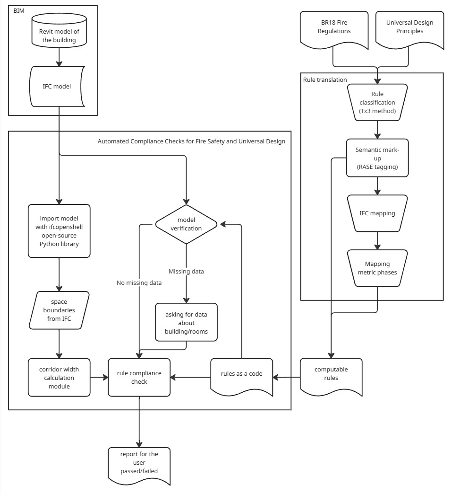

# Automated Compliance Checks for Fire Regulations and Universal Design
The AFU tool calculates the minimum width of the selected rooms and checks compliance with the following rules.

The *Danish fire regulation (BR18)* requirements for the minimum width of escape corridors. 

First requirement:
- The corridor is minimum 1.3 meters wide.

Second requirement:
- A large number of people are escaping through the corridor AND
- the building is in usage category 1, 2, 3 or 5 AND
- the corridor is wider than 10 mm per person escaping.

*Universal Design* recommendations for inclusive corridor width, based on the Building for Everyone: A Universal Design Approach – Entrances and Horizontal Circulation guideline:
- In public buildings, the corridor is minimum 2 meters wide.
- In other buildings, the corridor is minimum 1.5 meters wide.

The overall structure of the tool:



AFU takes an IFC model as input that was exported from a Revit model with the following settings: 
- IFC version should be **IFC 4x3** or **IFC 4x** 
- space boundaries should be set to **2nd Level**

The IFC model is imported using the opensource Python library IfcOpenShell. The space boundaries are identified and utilised as the boundaries of the corridors.

The user can input the data that is needed for the compliance check:
1. usage category of the building (categories explained in Appendix A)
2. which rooms are the fire escape corridors
3. number of people escaping through each fire escape corridor
4. if the building is open to the public.

Using the calculated minimum width and the computed rules, the AFU tool performs the checks
and returns one of the following results:

- The corridor is not wide enough according to the fire regulations in BR18, and it needs to
be redesigned.
- The corridor meets the fire regulations in BR18 but is not wide enough to comply with UD
principles; therefore, redesigning it would be beneficial.
- The corridor complies with both the fire regulations in BR18 and UD principles, and no
redesign is necessary.

The results can be exported into a PDF file.

# Python App - Quick Start Guide

This guide will help you get the app running on your Windows machine. No programming experience needed — just follow the steps!


## What You Need

- A computer with **Windows**
- **Internet access**
- [Python 3.10](https://www.python.org/downloads/release/python-3100/)


## Setup Instructions

### 1. Install Python (Only once)

1. Download Python 3.10 from: https://www.python.org/downloads/release/python-3100/
2. Run the installer.
3. **IMPORTANT:** Make sure to check the box that says **"Add Python to PATH"**.
4. Complete the installation.


### 2. Download the App

#### Option A: If you have Git

Open Command Prompt and run:

```bash
git clone https://github.com/Brise07/AFU_tool
cd AFU_tool
```

#### Option B: If you don't have Git

1. Go to the GitHub page of the project.
2. Click the green **Code** button → **Download ZIP**.
3. Unzip the folder.
4. Open Command Prompt and navigate to the folder.


### 3. Set Up the Environment

In the same Command Prompt window, run:

```bash
pip install uv
uv venv
uv sync
```

This installs the necessary tools and sets up the environment.


### 4. Activate the Environment

Run this command to activate the virtual environment:

```bash
.venv\Scripts\activate
```

You should now see a prompt like this:
```
(AFU_tool) C:\YourProjectPath\AFU_tool>
```


### 5. Run the App

Now start the app with:

```bash
python app.py
```

Or if that doesn’t work, try:

```bash
py app.py
```


## Need Help?

- Make sure you're inside the project folder in Command Prompt.
- Check each command for typos.
- If something still doesn't work, feel free to reach out!

---

Enjoy using the app!
